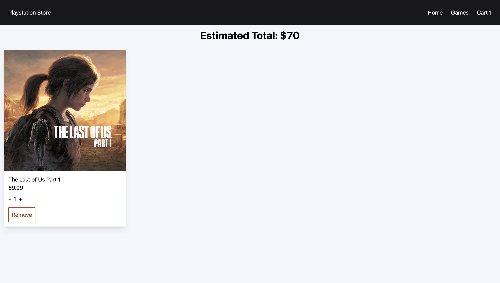

## SHOPPING APP

**Description**

- A Shopping Cart App inspired by the Playstion Store

#

**SCREENSHOTS**

#

**OVERVIEW**

- Simple user interface
- Can add and remove games from cart
- Responsive Design
- useReducer and useContext hook implementation
- Tailwindcss for styling
- React Testing Library implementation
- React Router Implementation
- Overall, very fun project. Learning how to implement useReducer and useContext in this react project was crucial for this project. Learning and using Tailwind was also a fun addition to this project.

#

**LIVE LINK**

[CLICK HERE]()

#

**TECH USED**

#

**ENJOY**
